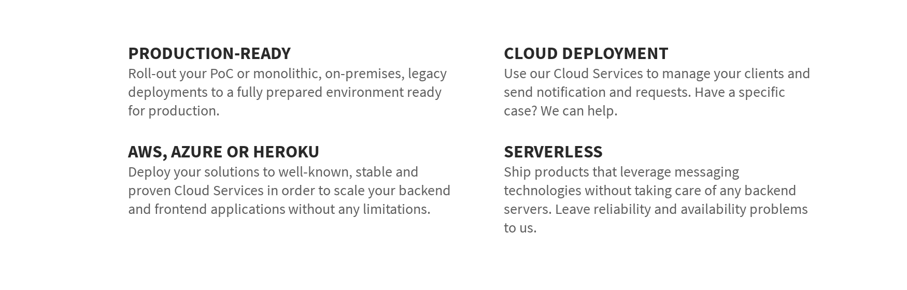

<div align="center">
  <a href="https://github.com/elpheria/rpc-websockets">
    
  </a>
  <br>
  <p>
    WebSockets for <a href="http://nodejs.org">Node.js</a> and <a href="https://en.wikipedia.org/wiki/JavaScript">JavaScript</a> with <a href="https://www.jsonrpc.org/specification">JSON RPC 2.0</a> support on top.  </p>
  <br>
	<a href="https://github.com/elpheria/rpc-websockets/blob/master/LICENSE">
		
	</a>
  <a href="https://travis-ci.org/elpheria/rpc-websockets">
		
	</a>
  <a href="https://coveralls.io/github/elpheria/rpc-websockets?branch=master">
		
	</a>
  <a href="https://www.npmjs.com/package/rpc-websockets">
    
  </a>
  <br>
  <a href="https://nodei.co/npm/rpc-websockets">
		
	</a>
  <br><br><br>
</div>

## About

The **rpc-websockets** library enables developers to easily implement their business logic that includes messaging between users, machines or any devices. It provides a possibility to send and receive JSON data through the WebSocket communication protocol in order to support two-way notification push, running RPC methods and firing any types of event signalling. Both frontend (HTML/JS-based) and backend (Node.js-based) development environments are supported.

**rpc-websockets** is built on Node.js and supports both LTS and Current versions.

Use the free OSS edition in order to implement and manage your own WebSocket server instances, or subscribe for our [Pro plan](#pro-features) and have us manage your instances and provide you with management of your methods, events and notifications on an easy-to-use Web Management portal.

## Quick start

Install our OSS library in your project:
```
npm install rpc-websockets
```

Write your source code using `rpc-websockets`:
```js
var WebSocket = require('rpc-websockets').Client
var WebSocketServer = require('rpc-websockets').Server

// instantiate Server and start listening for requests
var server = new WebSocketServer({
  port: 8080,
  host: 'localhost'
})

// register an RPC method
server.register('sum', function(params) {
  return params[0] + params[1]
})

// create an event
server.event('feedUpdated')

// get events
console.log(server.eventList())

// emit an event to subscribers
server.emit('feedUpdated')

// close the server
server.close()

// instantiate Client and connect to an RPC server
var ws = new WebSocket('ws://localhost:8080')

ws.on('open', function() {
  // call an RPC method with parameters
  ws.call('sum', [5, 3]).then(function(result) {
    require('assert').equal(result, 8)
  })

  // send a notification to an RPC server
  ws.notify('openedNewsModule')

  // subscribe to receive an event
  ws.subscribe('feedUpdated')

  ws.on('feedUpdated', function() {
    updateLogic()
  })

  // unsubscribe from an event
  ws.unsubscribe('feedUpdated')

  // close a websocket connection
  ws.close()
})
```

## Documentation

Please consult our [API documentation](API.md) for both WebSocket server and client JavaScript classes.

## OSS Features

Features of the free open-source edition.


All library's open-source features are documented in our [API documentation](API.md) and can be used free of charge. You are free to implement your solutions based on provided methods in any way you are comfortable with, as long as you use our work along our very permissive [license](LICENSE) conditions.

## Pro Features

In order to support your production-ready environments, we can provide you with additional features built on top of our free OSS edition along with the skill set to turn your business case or a Proof-of-Concept idea into reality.



Describe us your use case by [contacting us](mailto:mario.kozjak@qaap.io?subject=Pro%20Plan%20enquiry) and we will swiftly get back to you with a proposed solution that meets your needs.

## Professional support

We offer professional support for **rpc-websockets** and beyond. We have many years of expertise on building robust, scalable Node.js applications and can help you overcome issues and challenges preventing you to ship your great products. We excel in software architecture and implementation, being able to provide you with development, planning, consulting, training and customization services. Feel free to [contact us](mailto:mario.kozjak@qaap.io?subject=rpc-websockets%20support%20enquiry) so we can discuss how to help you finish your products!

## Users

**rpc-websockets** is being actively used in production by multiple companies in a variety of different use cases.

<br>
<a href="https://scratchbox.io" target="_blank"></a>&emsp;
<a href="https://bitflyer.com/en-eu" target="_blank"></a>&emsp;
<a href="https://loomx.io" target="_blank"></a>&emsp;
<a href="https://www.uniqcast.com" target="_blank"></a>&emsp;

## Sponsors
Become a sponsor and get your logo on project's README on GitHub with a link to your site. Feel free to [contact us](mailto:mario.kozjak@qaap.io?subject=Sponsors) for the arrangement!

## License

  [MIT](LICENSE)
